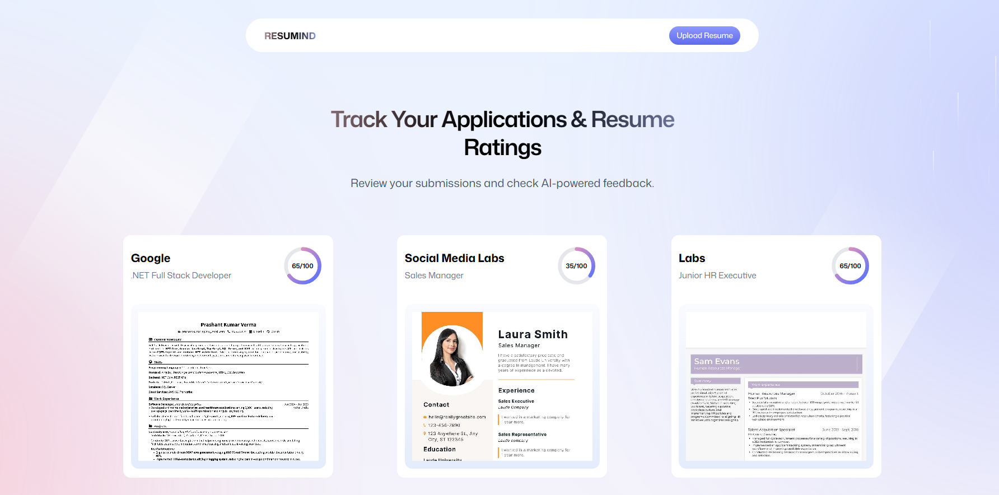
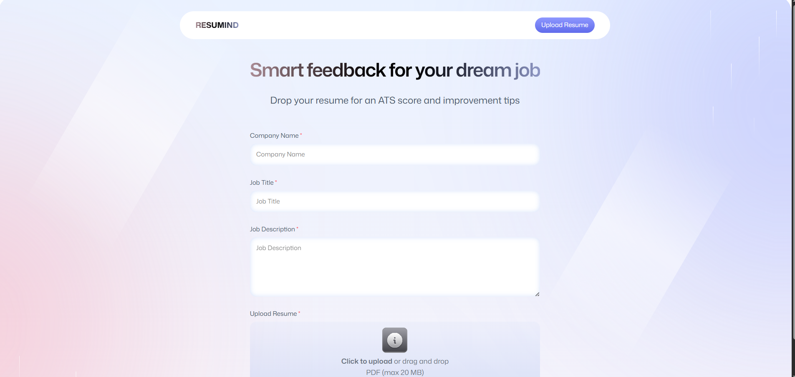
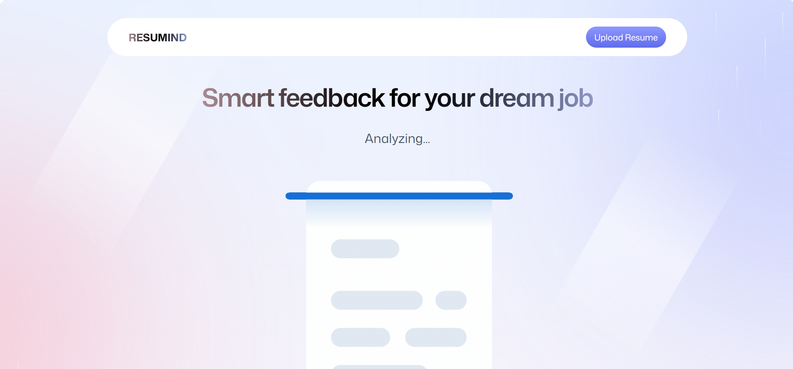
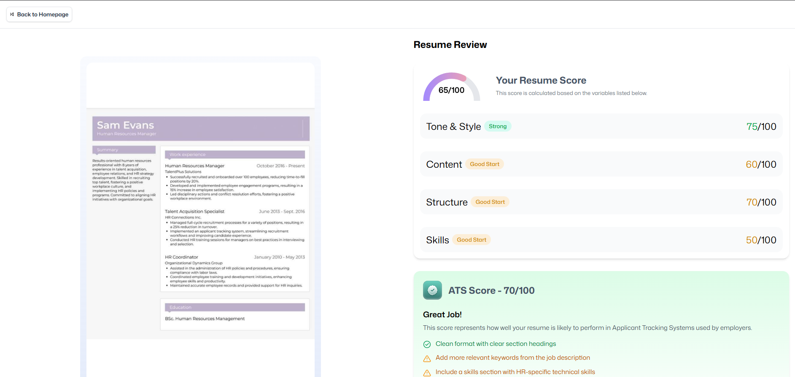

# 🧠 AI Resume Analyzer

> Build an **AI-powered Resume Analyzer** with **React**, **React Router**, and **Puter.js**!  
> Seamlessly authenticate users, upload and store resumes, and match candidates to jobs using smart AI evaluations.  
> Get **custom feedback** and **ATS scores** tailored to each listing — all wrapped in a **clean, reusable, and modern UI**.

---

## ✨ Introduction

Create a next-gen platform where users can:  
- 🔐 **Authenticate seamlessly** using Puter.js — no backend setup required  
- 📄 **Upload, manage, and analyze** resumes securely  
- 🤖 **Get AI-based job matching** and ATS scoring with detailed feedback  
- 🎨 **Experience a responsive and modern UI**, built with Tailwind CSS and shadcn/ui

---

## 🌆 Project Preview

Preview below 👇  

---

## ⚙️ Tech Stack

| Technology | Description |
|-------------|-------------|
| ⚛️ **React** | A powerful library for building reusable, dynamic user interfaces using components and virtual DOM. |
| 🧭 **React Router v7** | The go-to routing library for React apps with nested routes, loaders/actions, error boundaries, SSR, and code splitting. |
| ☁️ **Puter.com** | An open-source, fast, privacy-first internet OS — a personal cloud to store files, apps, and games securely. |
| 🧩 **Puter.js** | A lightweight client SDK providing auth, storage, database, and AI (GPT, Claude, DALL·E, OCR) directly in your browser — **no backend needed!** |
| 🎨 **Tailwind CSS** | A utility-first CSS framework for fast, custom UI design using low-level utility classes. |
| 🧑‍💻 **TypeScript** | A superset of JavaScript adding static typing, improved tooling, and better scalability. |
| ⚡ **Vite** | A lightning-fast build tool and dev server for modern web development with instant HMR and optimized builds. |
| 🪣 **Zustand** | A minimal, hook-based state management library for React — simple, fast, and scalable. |

---

## 🔋 Features

✅ **Easy & Secure Authentication**  
Handle auth completely in the browser with Puter.js — no backend setup or API keys needed.

✅ **Resume Upload & Storage**  
Let users upload, view, and manage resumes safely and reliably.

✅ **AI-Powered Resume Matching**  
Get ATS scores and feedback tailored to specific job descriptions.

✅ **Reusable, Modern UI Components**  
Built with Tailwind CSS + shadcn/ui for a clean, consistent look.

✅ **Code Reusability & Scalability**  
Modular architecture ensures clean, maintainable code.

✅ **Cross-Device Compatibility**  
Responsive design that works seamlessly across all screen sizes.

✅ **Sleek UI/UX Design**  
Modern layout with animations and a professional, polished feel.
